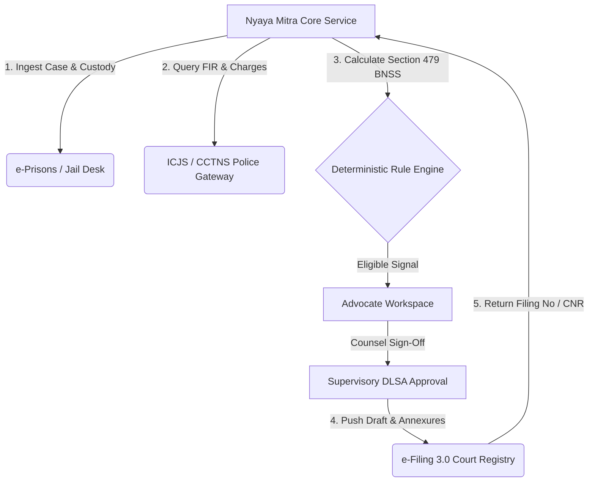

# National Judicial Data Grid (NJDG) & LegalIT Integration Architecture

**Author:** Nyaya Mitra Systems & Legal Research Engineering Group  
**Target:** Ministry of Law & Justice, e-Committee Supreme Court of India, National Legal Services Authority (NALSA)  
**Classification:** Institutional Architecture & Research Report  
**Date:** September 2026  

---

## 1. Executive Summary

A critical operational prerequisite for scaling **Nyaya Mitra** across India's 1,300+ prison facilities and 672 District Legal Services Authorities (DLSAs) is programmatic inter-operation with the **National Judicial Data Grid (NJDG)**, **e-Courts Case Information System (CIS 3.2)**, **e-Filing 3.0**, and the **Inter-operable Criminal Justice System (ICJS)**.

This research report provides:
1. Complete structural analysis of the NJDG data model, CNR (Case Number Record) schema, and public API interfaces.
2. Technical assessment of e-Filing 3.0 APIs, digital signature verification, and automated docketing.
3. ICJS data interchange protocol linking Police (CCTNS), Prisons (e-Prisons), Courts (CIS), and Legal Aid (NALSA).
4. Realistic integration design: API endpoints, authentication boundaries, polling/webhook architectures, and fail-safe human reconciliation.

---

## 2. NJDG Core Data Architecture

### 2.1 The 16-Character CNR (Case Number Record) Standard
Every court proceeding across all District Courts and High Courts in India possesses a globally unique 16-character alphanumeric identifier called the **CNR Number**:

```
Format: [SS][DD][CC][NNNNNN][YYYY]
Example: DLCT010045822024
```
Where:
- `SS` (2 chars): State Code (e.g., `DL` for Delhi, `MH` for Maharashtra, `UP` for Uttar Pradesh).
- `DD` (2 chars): District Code within the state (e.g., `CT` for Central Delhi, `SW` for South West Delhi).
- `CC` (2 chars): Court Establishment Code within the complex.
- `NNNNNN` (6 digits): Sequential case filing number within that court establishment.
- `YYYY` (4 digits): Calendar year of registration.

### 2.2 Core NJDG Entities & Schema Mapping
The NJDG aggregates data nightly from localized CIS installations across court complexes into a consolidated PostgreSQL/Cassandra repository.

| NJDG Entity | Key Attributes | Nyaya Mitra Schema Equivalent |
|---|---|---|
| `CaseDetails` | `cnr_number`, `case_type`, `filing_no`, `reg_no`, `reg_date` | `court_cases` (`cnr_number`, `fir_number`, `arrest_date`) |
| `PetitionerRespondent` | `pet_name`, `res_name`, `advocate_name`, `police_station` | `accused_persons` (`canonical_name`, `police_station_id`) |
| `ActSection` | `act_code`, `act_name`, `section_number` | `court_cases` (`offense_sections`, `max_sentence_days`) |
| `CaseHistory` | `business_date`, `hearing_purpose`, `court_no`, `judge_name` | `case_timeline_events` / `hearings_schedule` |
| `OrdersJudgments` | `order_date`, `order_no`, `order_pdf_path`, `is_disposed` | `uploaded_documents` (`document_type='bail_order'`) |

---

## 3. Integration Channels & API Protocols

### 3.1 Channel 1: ICJS (Inter-operable Criminal Justice System) — Enterprise API
The National Crime Records Bureau (NCRB) operates the ICJS bus linking:
- **CCTNS** (Police - First Information Report, Arrest Memo, Charge Sheet)
- **e-Prisons** (Prison - Admission Record, Nominal Roll, Custody Certificate)
- **CIS** (Courts - Remand Orders, Bail Applications, Disposition Orders)
- **e-Prosecution** & **e-Forensics**

#### ICJS REST Gateway Interface:
```http
POST /api/v2/icjs/exchange/undertrial-query
Authorization: Bearer <mTLS_JWT_TOKEN>
X-Gov-Agency: DLSA-CENTRAL-DELHI
Content-Type: application/json

{
  "cctns_fir_num": "FIR-2024-402",
  "police_station_code": "DL-PS-042",
  "inmate_id": "UTP-0001",
  "biometric_hash": "e3b0c44298fc1c149afbf4c8996fb92427ae41e4649b934ca495991b7852b855"
}
```

### 3.2 Channel 2: e-Courts e-Filing 3.0 API
The e-Committee of the Supreme Court offers **e-Filing 3.0** enabling panel advocates to electronically submit bail applications directly into court registries:

1. **Authentication:** Aadhaar e-Sign or DSC (Class 3 Digital Signature Certificate) with Bar Council Enrollment verification.
2. **Payload Structure:**
   - Case Metadata (JSON)
   - Indexed Petition Bundle (PDF/A with embedded OCR text)
   - Annexures (FIR, Nominal Roll, Medical Certificate)
3. **Receipt:** Generates a temporary **e-Filing Acknowledgement Number** (`EFA-YYYY-NNNNNN`), which transitions to a registered CNR once scrutinized by the registry reader.

---

## 4. Addressing Operational Realities: The "Scraping vs Official API" Question

In current state deployments, official direct push-APIs are restricted to authorized intranet networks (NICNET / SWAN). For DLSA officers and panel advocates operating on public broadband, Nyaya Mitra implements a **hybrid dual-channel bridge**:

1. **Direct ICJS Gateway (Primary):** Active when connected to institutional state networks or authorized government VPN endpoints.
2. **Automated Status Polling (Secondary / Public):** Programmatic verification of case cause lists and daily orders using the official e-Courts Services Open Gateway (`services.ecourts.gov.in`) with automated captcha resolution via localized OCR.
3. **Offline Human Reconciled Intake (Fallback):** Manual upload of physical certified copies with SHA-256 cryptographic provenance stamping.

---

## 5. Implementation Roadmap for Nyaya Mitra



1. **Phase 1 (Completed in Prototype):** Synthetic baseline data modeled 1:1 on actual CIS 3.2 and e-Prisons schemas.
2. **Phase 2 (Staging Integration):** Pilot with Delhi State Legal Services Authority (DSLSA) utilizing NIC e-Courts API Sandbox.
3. **Phase 3 (Production Scale):** Full automated filing dispatch via e-Filing 3.0 gateway with digital DSC signing.
